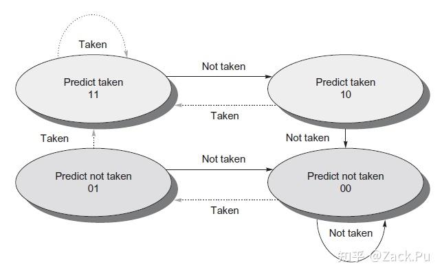

## 先回顾一下最简单的2-bit Counter...

有很多中状态机形式，但是最简单的是这种：

| 00 | 01 | 10 | 11 |
| strongly not taken | weakly not | weakly taken | strongly taken |

更新方式就是根据前一个分支的具体跳转情况：
taken +1， not taken -1

当然还有一种优化的更好的：

这种状态机只有在 taken/not taken 2 times才能完成预测转移，更加stable

## 引入全局历史：

我们把这种仅仅2bit的行为称为局部分支历史。
我们会引入一个新的全局历史表：

一个最简单的编码形式是：
我们加入1bit的全局历史位来记录:
(1, 2)分支预测器：
"最近的分支"
```
history = 最近一个分支结果，1 bit

history = 0  →  用 predictor[0]
history = 1  →  用 predictor[1]

predictor[0] 是一个 2-bit 状态机
predictor[1] 是另一个 2-bit 状态机
```
更新方式：

第一步：更新刚才用过的 counter
第二步：更新 history

假如是(2, 2)：
```
history = 00  →  counter[0]
history = 01  →  counter[1]
history = 10  →  counter[2]
history = 11  →  counter[3]
```


## GShare:


### index
我们之前全部都是用这个histoty寄存器来进行index一个counter
这就是index
另外还有一种方式：
就是用过pc来选择我当前应该使用哪个counter：

本质上和cache的index完全一样：
我们可以让index取在中间几个bit，利用好spatial（分支）localiy

但是此时，我们的取法和历史就没什么关系了，
但是之前的分支历史对于我们来说还是有意义的。
同时，单纯的分支历史index对我们来说也是有点问题的。

gshare利用XOR运算，综合利用了pc和history reg：

### gshare:

GHR：Global History Register，全局历史寄存器
PHT：Pattern History Table，模式历史表

index = PC bits XOR GHR

更新：
```
actual Taken:
    counter saturating increment

actual Not Taken:
    counter saturating decrement
```

然后更新history：
```
GHR = (GHR << 1) | actual_bit
```


