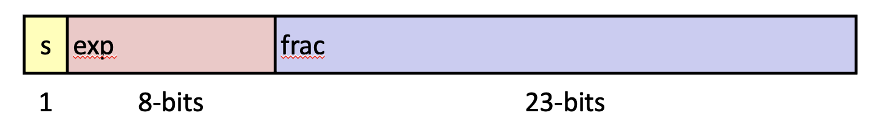
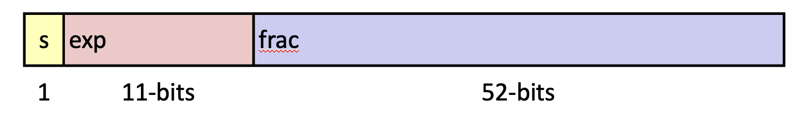
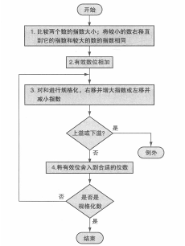
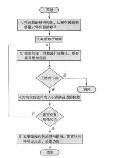

# Encode:

- S：符号位
- Exponent： biased exponent
- Fraction：significand fraction
- M：有效数 significand
- E：真实指数 exponent

single precision:




double precision:



# Normalized:


## for frac:
__Why?__

multi-ways to stand for the same value:

0.2 = 2 * 10^-1 = 0.2 * 10^-2

__How__
a hidden "1."
```
significand = 1.{frac}
```

## for exp:

E = Exp - Bias:


- Exp: exp, original binary
- Bias: 127, for 8bits:
- E: mathmetical Exponent

further more:
$exp \not= 00...0 or 11...1$
in 8bits:
$exp\not=0 or 254$

___注意！！！：___
bias是127而不是128
0对应0111_1111
exp：-126-+127
全0和全1被拿走了


# Unnormalized Value:
- NaN
- +0 -0
- $+\inf -\inf$


exp全0, frac全0: +0 -0

exp全1，frac全0：+inf -inf

其他都是NaN

+0/-0:
1 / +0 = +∞
1 / -0 = -∞

# unnormalized还能分：
exp = 00...0   -> zero / subnormal
exp = 11...1   -> infinity / NaN


subnormal还能表示成值

通俗来说，subnormal最小正值是：
$2^{-127} * 2^{-22}$
这里认为M是0.frac






__注意__!!!
一定要相加完，规格化完之后再舍入！不然会丢失信息。
硬件也会多几个bit来实现这一点

# 注意几种rounding
round down
round up
round to even(默认)
