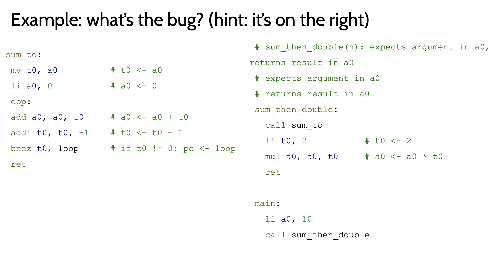
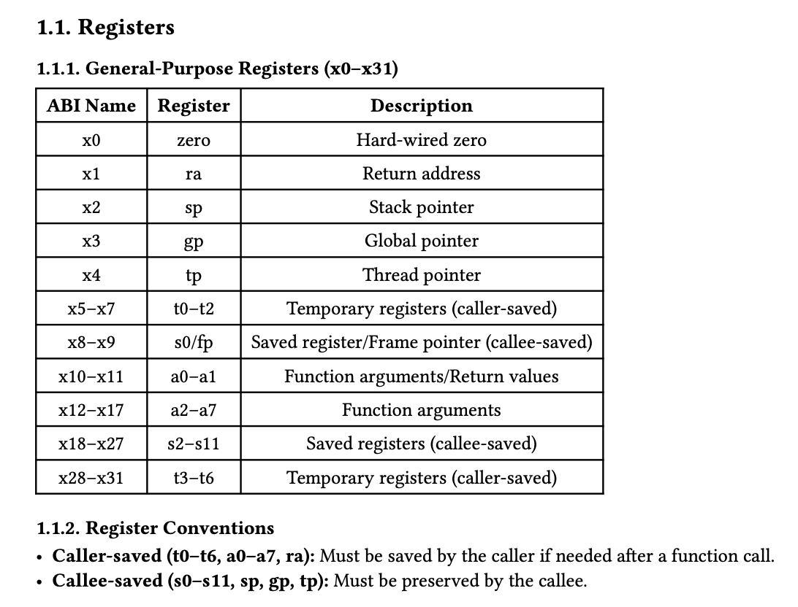
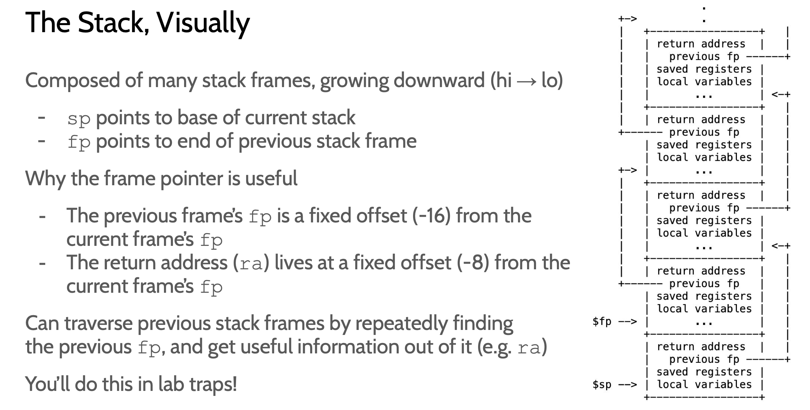

# 总体流程：
caller 侧：
  1. 准备参数：a0-a7，超过 8 个放栈上
  2. 必要时保存 caller-saved registers
  3. jal / jalr 调用函数

callee 侧：
  1. prologue：建立栈帧，保存 ra / s0-s11 等需要保存的寄存器
  (这里包括了作为caller/callee的各种寄存器。一个函数可以是caller也可以是callee)
  2. function body
  3. epilogue：恢复寄存器，释放栈帧，ret


prologue是save的动作
caller和callee可能都有

epilogue只是恢复


# 一个例子：
最典型的就是ra。假如一个函数想要call一个函数：

在这里，main call sum_then_double的时候：
ra正确，为main call的pc + 4
但是在sum_then_double call sum_to的时候，ra被覆盖
导致sum_then_double的ret只会回到自己




# fp:
值得关注的还有s0/fp
frame pointer:
观察下面代码：

```riscv
int namecmp(const char *s, const char *t)
{
    80003156:   1141                    addi    sp,sp,-16
    80003158:   e406                    sd  ra,8(sp)
    8000315a:   e022                    sd  s0,0(sp)
    8000315c:   0800                    addi    s0,sp,16
return strncmp(s, t, DIRSIZ);
    8000315e:   4639                    li  a2,14
    80003160:   ffffd097            auipc   ra,0xffffd
    80003164:   0e8080e7            jalr    232(ra) # 80000248 <strncmp>
}
    80003168:   60a2                    ld  ra,8(sp)
    8000316a:   6402                    ld  s0,0(sp)
    8000316c:   0141                    addi    sp,sp,16
    
    8000316e:   8082                    ret
```


可以看到s0 = sp + 16。这事实上是顶端。

对于自己的ra: 存放于 [8:15]
对于previous fp：存放于[0:7]

自己的fp,指向顶端。其实也是上一个frame的底部



这个图完全没说错：
current fp: sp + 16
previous fp：sp


# 叶子call推演：

对于叶子function。他无需call任何人。
他不需要save ra。不需要save任何caller save的reg

# root call 推演
不需要save任何callee saved
没有epilogue


# 超过8个参数：
    addi sp, sp, -16

    li   t0, 9
    sd   t0, 0(sp)      # 第 9 个参数

    li   t0, 10
    sd   t0, 8(sp)      # 第 10 个参数

    li   a0, 1
    li   a1, 2
    li   a2, 3
    li   a3, 4
    li   a4, 5
    li   a5, 6
    li   a6, 7
    li   a7, 8

    call f

    addi sp, sp, 16


    f:
    # a0-a7 已经是前 8 个参数

    ld t0, 0(sp)        # 第 9 个参数
    ld t1, 8(sp)        # 第 10 个参数

存在栈上。
这里确实让子函数访问父函数的栈了。但是没办法就是这样规定的