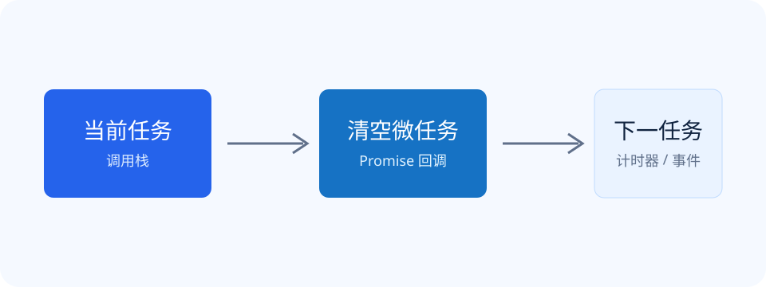

JavaScript 的事件循环并不神秘。它解决的核心问题是：当主线程忙于执行同步代码时，异步任务应该在什么时候获得执行机会？



## 基本组成

理解事件循环，先记住三个组成部分：

| 部分 | 作用 |
| --- | --- |
| 调用栈 | 执行当前的同步代码 |
| 任务队列 | 保存计时器、事件等回调 |
| 微任务队列 | 保存 Promise 回调等优先任务 |

### 调用栈

函数被调用时进入调用栈，执行结束后离开。只有调用栈清空，事件循环才会选择下一个任务。

### 微任务

每个任务结束后，运行时会清空当前的微任务队列，然后才进入下一个任务。

```js
console.log('A');

setTimeout(() => console.log('B'), 0);
Promise.resolve().then(() => console.log('C'));

console.log('D');
```

输出顺序是 `A → D → C → B`。同步代码先执行，随后清空微任务，最后执行计时器任务。

## 一个实用模型

> 执行一个任务，然后清空微任务；浏览器可以选择渲染，再进入下一个任务。

这个模型不是完整规范，但足以解释大多数应用代码里的执行顺序问题。

## 值得继续追问

- 微任务不断产生新微任务时，页面渲染会发生什么？
- Node.js 的事件循环与浏览器有哪些区别？
- `requestAnimationFrame` 位于怎样的时机？
